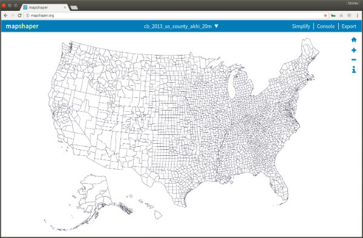

# cdc_diabetes  
CDC diabetes and obesity data flexdashboard

static diabetes tmap dashboard  
https://rockourdata.nyc3.digitaloceanspaces.com/county_diabetes_tmap_flexdash.html
tmap to interactive leaflet diabetes map dashboard   
https://rockourdata.nyc3.digitaloceanspaces.com/county_diabetes_tmap2leaflet_flexdash.hmtl

### 1. Clone the repository  
```bash
git clone https://github.com/stoneyv/cdc_diabetes.git
```
### 2. Download the data  
```bash
cd cdc_diabetes
chmod +x download-data-cdc.sh  
./download-data-cdc.sh
```
### 3. Create shapefiles with AK,HI below the US.
Bob Rudis explains how to do this with maptools::elide here  
https://rud.is/b/2014/11/16/moving-the-earth-well-alaska-hawaii-with-r/  
```bash
Rscript ./R/create_county_akhi.R
Rscript ./R/create_state_akhi.R
```
Now drag and drop the ./data/shapefiles/cb_2013_us_county_akhi_20m/cb_2013_us_county_akhi_20m.shp file on to http://mapshaper.org/ and click import to verify the new shapefile.  


### 4. Transform the CDC diabetes and obesity data
This loads data from spreadsheets and joins it with a modified 2013 US Census County shapefile.  
```bash
Rscript ./R/transform_cdc_data.R
```
### 5. Create one of the dashboards such as flexdashboard, shiny + flexdashboard
* Open the ./R/county_diabetes_tmap_flexdash.Rmd file in rstudio.
* Click the knit button to generate the flexdashboard html file.
* There is an R version of the file to make it easier to debug modifications to the dashboard.
* If you uncomment the ttm() line the tmap will be implemented as an interactive leaflet map.
