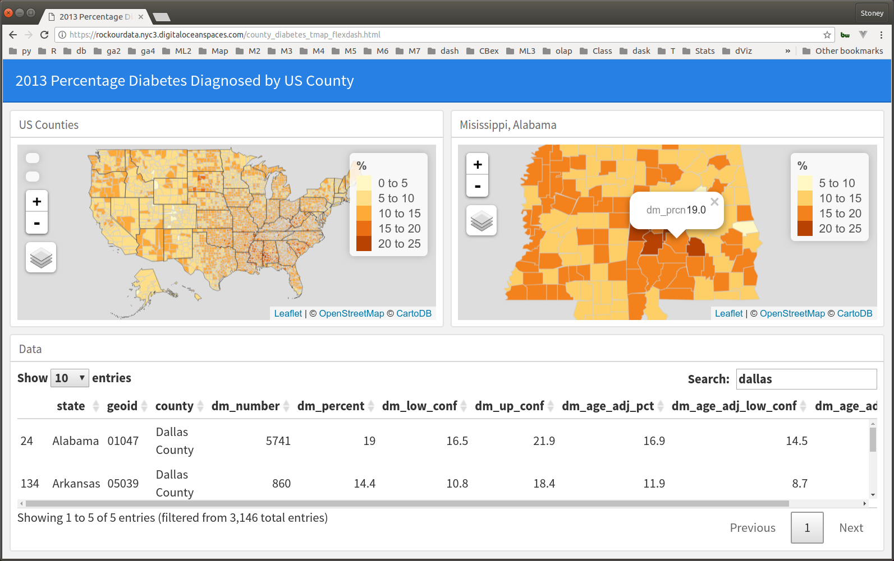

# cdc_diabetes  
CDC diabetes and obesity data flexdashboard



### 1. Clone the repository  
```bash
git clone https://github.com/stoneyv/cdc_diabetes.git
```
### 2. Download the data  
```bash
cd cdc_diabetes
chmod +x download-data-cdc.sh  
./download-data-cdc.sh
```
NOTE: MS Windows OS users can use the bash shell script for downloading and unpacking the data files by using one of these options.  
a. Anaconda bash shell with unix utilities  
https://www.anaconda.com/download  
b. Cygwin bash shell with unix utilities    
https://www.cygwin.com/  
c. MS Windows Linux subsytem   
https://docs.microsoft.com/en-us/windows/wsl/install-win10  

NOTE: If you are using a MS Windows OS and do not have a bash shell or an Rscript command, you can still call R scripts from the command line by invoking R with the -e option.  Look below for an example of invoking R from a regular Windows shell.

### 3. Install system libraries and R packages
a. system libraries GDAL and GEOS  
b. R packages  

### 4. Create shapefiles with AK,HI below the US.
Bob Rudis explains how to do this with maptools::elide here   
https://rud.is/b/2014/11/16/moving-the-earth-well-alaska-hawaii-with-r/  
```bash
Rscript ./R/create_county_akhi.R
Rscript ./R/create_state_akhi.R
```

### 5. Transform the CDC diabetes and obesity data
This loads data from spreadsheets and joins it with a modified 2013 US Census County shapefile.  
```bash
Rscript ./R/transform_cdc_data.R
```
Now drag and drop the ./data/shapefiles/cb_2013_us_county_akhi_20m/cb_2013_us_county_akhi_20m.shp file on to http://mapshaper.org/ and click import to verify the new shapefile.  Click console and enter info to see the data that has been joined with the shapefile.
```
info
```


### 6. Create one of the flexdashboards.  Currently there is a leaflet and a tmap to leaflet implementation.
NOTE: If you receive a YAML error you may be missing the CRAN rmapshaper library.  If you have difficulty installing the rmapshaper package you may be missing the folowing system libraries. libjq-dev, libv8-dev,protobuf, and protobuf-compiler.  You can install these system libraries and then install the CRAN package rmapshaper.  You can also knit the project without the orientation and it will work without the rmapshaper library.  

a. Open the ./R/county_diabetes_leaflet.Rmd file in rstudio.  
b. Click the knit button to generate the flexdashboard html file.  
c. There is an R version of the file to make it easier to debug modifications to the dashboard.  

NOTE: you can do this from the command line as well. Invoke R from the main cdc_diabetes directory instead of cdc_diabetes/R so that the relative paths for reading data and shapefiles match.  

Mac OSX or Linux example  
```bash
R -e "rmarkdown::render(input=\"./R/county_diabetes_tmap_flexdash.Rmd\", output_dir=\"./R\")"
```
Windows terminal example  
```
"C:\Program Files\R\R-3.4.2\bin\x64\R.exe" -e "rmarkdown::render(input='county_diabetes_tmap_flexdash.Rmd', output_dir=\'.\R\')"
```

