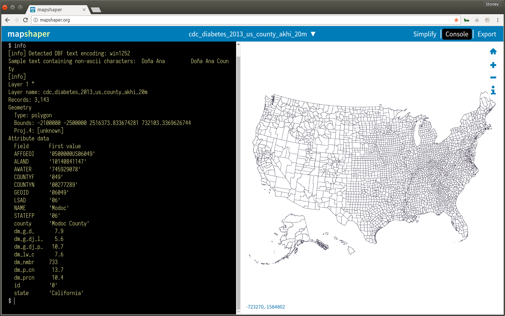

# cdc_diabetes  
CDC diabetes and obesity data flexdashboard

tmap to leaflet flexdashboard
https://rockourdata.nyc3.digitaloceanspaces.com/county_diabetes_tmap_flexdash.html  

leaflet flexdashboard
https://rockourdata.nyc3.digitaloceanspaces.com/county_diabetes_leaflet.html

### 1. Clone the repository  
```bash
git clone https://github.com/stoneyv/cdc_diabetes.git
```
### 2. Download the data  
```bash
cd cdc_diabetes
chmod +x download-data-cdc.sh  
./download-data-cdc.sh
```
### 3. Create shapefiles with AK,HI below the US.
Bob Rudis explains how to do this with maptools::elide here  
https://rud.is/b/2014/11/16/moving-the-earth-well-alaska-hawaii-with-r/  
```bash
Rscript ./R/create_county_akhi.R
Rscript ./R/create_state_akhi.R
```

### 4. Transform the CDC diabetes and obesity data
This loads data from spreadsheets and joins it with a modified 2013 US Census County shapefile.  
```bash
Rscript ./R/transform_cdc_data.R
```
Now drag and drop the ./data/shapefiles/cb_2013_us_county_akhi_20m/cb_2013_us_county_akhi_20m.shp file on to http://mapshaper.org/ and click import to verify the new shapefile.  Click console and enter info to see the data that has been joined with the shapefile.
```
info
```


### 5. Create one of the flexdashboards.  Currently there is a leaflet and a tmap to leaflet implementation.
NOTE: If you receive a YAML error you may be missing the CRAN rmapshaper library.  If you have difficulty installing the rmapshaper library you may be missing the folowing system libraries. jq, protobuf, protobuf-compiler.  You can knit the project without the orientation and it will work without the rmapshaper library.  
a. Open the ./R/county_diabetes_tmap_flexdash.Rmd file in rstudio.  
b. Click the knit button to generate the flexdashboard html file.  
c. There is an R version of the file to make it easier to debug modifications to the dashboard.  
